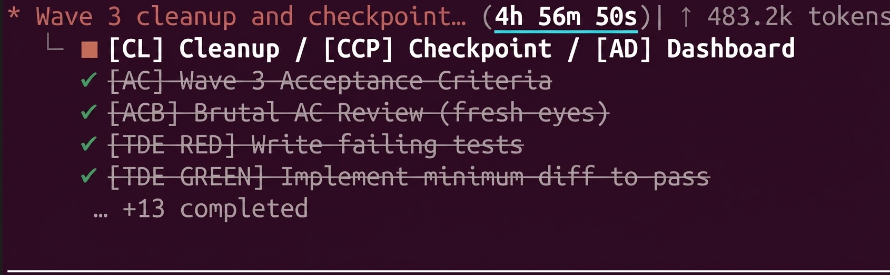

# claude-wave-plugin

[](https://github.com/Harshvardhan86/claude-wave-plugin/blob/main/LICENSE) [](https://github.com/Harshvardhan86/claude-wave-plugin/blob/main/CHANGELOG.md) [](https://docs.claude.com/en/docs/claude-code/plugins) [](https://github.com/Harshvardhan86/claude-wave-plugin/blob/main/CONTRIBUTING.md)

> Run Claude Code like an engineering org. Wave-based execution with dedicated sub-agents per phase, computed-style visual verification, no "tsc passes" lies.



*A real `/wave-start` run end-to-end: 17 phases dispatched through dedicated sub-agents, TDD-RED → GREEN → visual gates → cleanup → checkpoint. Unattended.*

The defaults of "vibe-coding" optimise for *time-to-first-demo*. This plugin optimises for *time-to-shippable*.

---

## Table of contents

- [How is this different?](#how-is-this-different)
- [Why this exists](#why-this-exists)
- [Prerequisites](#prerequisites)
- [Install](#install)
- [Quickstart — your first wave](#quickstart--your-first-wave)
- [What you get](#what-you-get)
- [Hook enforcement (v0.2.0)](#hook-enforcement-v020)
- [The 10 invariants](#the-10-invariants-verbatim-from-v1-preserved-in-v2)
- [The 5 hard-won rules](#the-5-hard-won-rules-the-demo-skills-add-on-top)
- [Repository structure](#repository-structure)
- [Community](#community)
- [Used in production by](#used-in-production-by)
- [Talks & writing](#talks--writing)
- [Status](#status)
- [Contributing](#contributing)
- [License](#license)

---

## How is this different?

|                              | claude-wave-plugin           | Superpowers              | Vanilla Claude Code |
|------------------------------|------------------------------|--------------------------|---------------------|
| Workflow philosophy          | Evidence-first verification  | Brainstorm → plan → execute | One-shot prompts |
| Phases per feature           | 17 base + 2 conditional      | 7 stages                 | None                |
| TDD enforcement              | Hooks gate RED → GREEN order and evidence-file markers | Recommended              | None                |
| Visual verification gates    | ✅ Computed-style assertions | ❌                       | ❌                  |
| Sub-agent isolation          | ✅ Per-phase, lean context   | ✅                       | ❌                  |
| Auto-compact recovery        | ✅ Checkpoint resume          | ❌                       | ❌                  |
| Best for                     | Production codebases where bugs cost money | Greenfield features, creative flow | Prototypes |

Both `claude-wave-plugin` and Superpowers are serious frameworks built by people shipping real code with Claude Code. They optimise for different problems. If you're brainstorming a new product feature, Superpowers' creative flow is excellent. If you're shipping into a production codebase where "the agent said it's done" is not acceptable evidence, this plugin is for you.

## Why this exists

Most Claude Code workflows are one-shot: type a prompt, get a diff, ship it. That works for prototypes. It produces piles of fake-done features in production codebases — features whose tests pass but whose pages render blank, whose configs validate but whose runtime never reads them, whose `data-theme="dark"` attribute gets set on `<html>` while the screenshot stays light.

Wave-based execution treats Claude Code as an **orchestration layer**, not an autocomplete. Every phase of shipping a feature gets its own dedicated sub-agent with lean context — and the orchestrator gates each hand-off on real evidence (live stack screenshots, computed-style assertions, true end-to-end runs), not on "build clean".

This plugin packages that workflow.

## Prerequisites

- **Claude Code** installed and authenticated. See the [official docs](https://docs.claude.com/en/docs/claude-code/overview).
- A project to run waves against (any language / stack).
- For hook enforcement: Bash, Git, `jq`, `flock`, `realpath` and standard shell utilities.
  Missing hook prerequisites warn and allow; install them for the gates to operate.
- For UI waves: a browser-driving setup such as Playwright. The framework's TEET phase uses Playwright via the official MCP.
- Optional but recommended: the [CodeRabbit plugin](https://www.coderabbit.ai/) if you want the `[CR]` Code Review gate at Phase 3.5.

## Install

```bash
# Add this repo as a plugin source
/plugins marketplace add https://github.com/Harshvardhan86/claude-wave-plugin

# Then install the plugin
/plugins install claude-wave-plugin
```

After installation you should see two new slash commands available:

- `/wave-start`
- `/wave-checkpoint`

…and six skills registered: `wave-orchestrator`, `ac-writer`, `design-reviewer`, `red-tests`, `green-impl`, `teet-verify`.

### Manual install (no marketplace)

If you'd rather install directly:

```bash
git clone https://github.com/Harshvardhan86/claude-wave-plugin.git \
  ~/.claude/plugins/local/claude-wave-plugin
```

Restart Claude Code. The plugin should be picked up automatically.

## Quickstart — your first wave

In any project you want to ship a feature in:

```bash
/wave-start --demo "make the save button show a loading spinner"
```

What you'll see:

1. The orchestrator dispatches the **AC** sub-agent. `.wave/ac.md` lands with brutal, testable criteria.
2. **DR** sub-agent audits your design system's installed dist files, writes a per-route mockup, defines computed-style visual ACs. Any design-system gap becomes an OPEN item that pauses the wave.
3. **RED** writes failing tests against those ACs and prints the failure output. *That's the point.*
4. **GREEN** writes the minimum code, starts the live stack, runs the full test suite, takes a Playwright screenshot.
5. **Visual approval gate.** The orchestrator stops, shows you the screenshot, asks you to confirm before proceeding.
6. **TEET** runs cross-system computed-style assertions and produces the final verdict.

If the agent says "done" without showing you a screenshot, refuse the hand-off — that's the failure mode the plugin exists to prevent.

Once you've shipped two or three waves with `--demo` successfully, drop the flag:

```bash
/wave-start "implement the new payment flow"
```

This invokes the canonical pipeline: 17 base phases plus `[DR]` (auto-engaged for UI waves) and optional `[CR]` (opt-in via `cr_enabled`). Brutal AC, Silent Error Analysis, Brutal SEA, Dependency Audit, Output Alignment, Brutalised E2E, version bump, commit, cleanup, checkpoint, dashboard — all dispatched as separate Agents with proper Opus / Sonnet / Haiku model routing.

If context fills before completion, `/wave-checkpoint` writes resume state to `.wave/checkpoints/`. A fresh session picks up exactly where you left off.

## What you get

### The full v2 framework (`framework/`)

This plugin **vendors the complete Wave Execution Framework v2** — refined over months of production engineering work where bugs cost real money. 17 base phases plus two conditional gates: `[DR]` Design Review at Phase 1.5 (mandatory whenever the wave ships UI — web, mobile, Storybook, CLI-TUI) and `[CR]` Code Review at Phase 3.5 (optional, opt-in). Maximum surface per wave: 19 phases. Model-routed across Opus / Sonnet / Haiku, with hook-enforced invariants and worktree isolation for writing dispatches.

### Demo on-ramps (`skills/`)

For first-time users, small features, and live-demo segments, the plugin ships **five polished entry skills** plus the orchestrator:

| Skill | Phase | Owns |
| --- | --- | --- |
| `wave-orchestrator` | Router | Full/demo dispatch and hand-off gates; solo mode for direct tasks |
| `ac-writer` | 1. Acceptance Criteria | Brutal, testable ACs grounded in real visual vocabulary |
| `design-reviewer` | UI: pre-RED gate (matches Phase 1.5) | Component API audit, per-route mockup, visual ACs |
| `red-tests` | RED | Failing tests *first*, prove they fail before any code is written |
| `green-impl` | GREEN | Minimum implementation, verify-before-scan: live stack + tests + screenshot |
| `teet-verify` | TEET | True end-to-end with computed-style assertions, not `toBeVisible()` lies |

These run as `/wave-start --demo "<feature>"`. The recommended starting point.

### Commands (`commands/`)

- `/wave-start <feature>` — runs the full v2 pipeline (17 base + conditional `[DR]` and `[CR]` gates)
- `/wave-start --demo <feature>` — runs the trimmed 5-phase entry subset
- `/wave-start --solo <feature>` — runs a direct task with explicit models, commit guard,
  PreCompact checkpoint and token ledger
- `/wave-checkpoint` — saves wave state to disk so an auto-compact (or laptop battery dying) doesn't kill the run

## Hook enforcement (v0.2.0)

An active wave now has executable gates: phase order, valid phase/role/model,
hand-off artifacts and markers, scope answers, design-review resolutions, UI
screenshot approval and bug-fix strategy approval. Hooks keep the full/demo
orchestrator focused on dispatch by gating tracked source edits, source reads,
recognised build/test commands, nested dispatches and forks. Third phase/role
rounds and output-token budget overruns require recorded approval.

Every main-session full/demo `Agent` dispatch starts its `description` with:

```text
[W:<wave> P:<PHASE> R:<lead|executor|reviewer|scanner|writer>]
```

For example: `[W:1 P:TDE-GREEN R:executor] implement AC-3`. The tag is
case-sensitive, begins at byte 0 and has exactly one space between fields. The
first line of `prompt` is accepted as a fallback. Name `model` explicitly;
full/demo routing requires at least the tier in `hooks/phases.tsv`.

- **Full** applies the full phase table and all process gates. DR runs for UI
  **or behaviour-changing** waves; CR is conditional on its scope flag.
- **Demo** applies the same rules to `AC`, `DR`, `TDE-RED`, `TDE-GREEN`, `TEET`.
  Skipped conditional or out-of-mode rows are looked through transitively so
  unfinished applicable predecessors cannot be bypassed.
- **Solo** (`/wave-start --solo`) keeps only the explicit-model rule, commit
  guard, PreCompact checkpoint and ledger. No tag, prompt caps, phase order,
  tiers, orchestrator-only rules, rounds or budgets are enforced.

`/wave-start` creates `.wave/state.json` before dispatch and records full/demo
scope answers with `scripts/wave-set.sh`. The state defaults to `enforce: "block"`.
**Escape hatch:** use `--enforce warn` when invoking `scripts/wave-init.sh`, or
set `enforce` to `warn` in the active `.wave/state.json`. Event-hook denials become
warnings with the same rule id and remedy. `wave-set.sh` changes scope flags only.
Close the wave with `scripts/wave-close.sh` when finished. With no active state,
plugin event hooks are silent; unreadable inputs and missing prerequisites warn
and allow.

Approvals, reports and checkpoints live under `.wave/`, excluded locally through
`.git/info/exclude`. Approval files record the user's decision; they are not
signatures or durable audit history. The commit guard checks staged planning
paths and message hygiene; `.wave/approvals/commit-doc.md` permits an intentional
planning-document exception. `wave-init.sh` also installs a Git `commit-msg`
guard when one is absent. That separate message guard remains active after a
wave closes and does not consult `enforce`.

The append-only `.wave/ledger.jsonl` records requested/resolved models and
input/output/cache tokens per agent, including failed hand-offs.
`scripts/wave-scorecard.sh` writes `.wave/scorecard.md` with spend, budget ratios,
rework and GREEN output per changed line. Model downgrades warn and are recorded. Long prompts
warn; copying ≥4,000 characters from a `.wave/` file into a prompt is denied.
Pass a report path and return a summary under 2,000 characters.

PreCompact now writes `.wave/checkpoints/<ts>-precompact.md` automatically;
`/wave-checkpoint` is the manual form. The checkpoint is enforced, the stop is
advised: Claude Code cannot block compaction through this hook. Start a fresh
terminal from the recorded resume instructions.

These gates check evidence files and markers, not the truth of test results.
Reviewers still verify the evidence. A Bash source write is outside the edit
guard; the build/test filter does not interpret shell indirection or aliases.
Main-session edit/read/build restrictions do not apply inside worktree
subagents, where the commit guard still inspects the worktree's index.

The plugin auto-loads `hooks/hooks.json`; **do not add `hooks` to the plugin
manifest**, because duplicate registration can drop all hooks. See the
[hook reference](framework/references/11-hooks-and-automation.md) for wiring,
stdin fields, every rule id and remedy, approval paths, load verification and rollback.

Release gates, from the repository root:

```bash
bash tests/run.sh
bash tests/run.sh --coverage
bash tests/clean-clone-check.sh
bash tests/e2e.sh
```

The first runs the cases; `--coverage` also fails missing positive/negative rule
controls. The clean-clone check covers the committed tree. Mutation drivers live
at `tests/tools/mutants-*.sh`. The end-to-end gate verifies an actual plugin load
and headless wave; it reports a skip when `claude` is unavailable. A filtered
pass, skipped live test or successful manifest validation alone is not a release gate.

## The 10 invariants (verbatim from v1, preserved in v2)

1. Lean context per unit — no "just in case" dumps.
2. Strict TDD — tests first, watch them fail, then implement.
3. Strict build order — build → app startup → tests.
4. Never assume on bugs — present **options**, user decides.
5. Save learnings globally after every bug fix (no duplicates, enhance existing).
6. Planning docs never committed to the code repo.
7. Auto-compact = STOP. Fresh terminal. Resume from checkpoint.
8. No team self-declares success — internal reviewer signs off first.
9. No hanging the system — teams must not deadlock or block indefinitely.
10. The orchestrator is the single throat to choke — all decisions and user interactions flow through it.

Invariant 6 is hook-enforced in v0.2.0. Invariant 7’s checkpoint is enforced;
its fresh-terminal stop is advised because PreCompact cannot block compaction. See [`framework/references/11-hooks-and-automation.md`](https://github.com/Harshvardhan86/claude-wave-plugin/blob/main/framework/references/11-hooks-and-automation.md).

## The 5 hard-won rules the demo skills add on top

These complement the invariants for UI work specifically:

1. **Verify before scan.** Never run BC/SEA/BSEA scanners on un-verified GREEN. Live stack + full test suite + screenshot first; *then* scan.
2. **Visual effect over DOM presence.** `toBeVisible()` returns true for a 0×0 element. Assert `getComputedStyle().backgroundColor`, `boundingBox` dimensions, and effective CSS bytes.
3. **Visual vocabulary grounding.** Never invent a color or token the app doesn't already render. Audit compiled CSS, not theoretical class names.
4. **Never implement without wiring.** Trace config → runner → handler end-to-end. A "catalog without dispatch" is a lie.
5. **Permissions once, upfront.** Ask for all permissions in a single consolidated request at session start. Never again.

Each rule was learned from a specific incident, not from a blog post.

## Repository structure

```
claude-wave-plugin/
├── .claude-plugin/
│   ├── plugin.json                              # plugin manifest (no hooks field)
│   └── marketplace.json                         # marketplace listing
├── README.md                                    # you are here
├── LICENSE                                      # MIT
├── CHANGELOG.md                                 # release history
├── CONTRIBUTING.md                              # PR / issue norms
├── .gitignore
│
├── framework/                                   # full Wave Execution Framework v2
│   ├── SKILL.md                                 # canonical pipeline + 10 invariants
│   └── references/                              # 12 load-on-demand reference docs
│       ├── 01-architecture.md
│       ├── 02-standing-teams.md
│       ├── 03-wave-pipeline.md
│       ├── 04-meta-orchestration.md
│       ├── 05-language-binding-rules.md
│       ├── 06-team-quick-reference.md
│       ├── 07-invariant-rules.md
│       ├── 08-worktree-strategy.md
│       ├── 09-platform-deltas.md
│       ├── 10-model-routing.md
│       ├── 11-hooks-and-automation.md
│       └── 12-mcp-and-plugins.md
│
├── skills/                                      # demo on-ramps + orchestrator
│   ├── wave-orchestrator/SKILL.md
│   ├── ac-writer/SKILL.md
│   ├── design-reviewer/SKILL.md
│   ├── red-tests/SKILL.md
│   ├── green-impl/SKILL.md
│   └── teet-verify/SKILL.md
│
├── commands/
│   ├── wave-start.md                            # /wave-start [--demo|--solo] "<feature>"
│   └── wave-checkpoint.md                       # /wave-checkpoint
│
├── hooks/                                       # auto-loaded wiring + rule data
│   ├── hooks.json                              # events, matchers, command timeouts
│   ├── phases.tsv                              # order, tiers, artifacts, markers
│   ├── models.tsv
│   ├── roles.tsv
│   ├── budgets.tsv
│   ├── planning-paths.tsv
│   ├── orchestrator-writable.tsv
│   └── reasons.tsv                             # rule ids, precedence, remedies
│
├── scripts/
│   ├── hooks/                                  # 11 event scripts + shared lib.sh
│   ├── wave-init.sh                            # state, local exclude, commit-msg guard
│   ├── wave-set.sh                             # scope answers
│   ├── wave-close.sh                           # wave lifetime
│   ├── wave-scorecard.sh                       # ledger report
│   └── qr.html                                 # parametric QR-code generator
│
└── tests/
    ├── run.sh                                  # cases; --coverage release gate
    ├── clean-clone-check.sh                     # committed-tree verification
    ├── e2e.sh                                   # plugin load + live headless checks
    ├── cases/                                  # JSON fixtures and shell cases
    ├── fixtures/                               # payloads, state and transcripts
    ├── golden/                                 # independent phase/tier and budget data
    ├── lib/                                    # harness assertions
    └── tools/mutants-*.sh                       # focused mutation drivers
```

## Community

- **X / Twitter:** [@Anim1986](https://x.com/Anim1986) — DM open for questions, suggestions, war stories
- **Issues & ideas:** Open an issue with the `.wave/<phase>.md` excerpt that surfaced the question
- **Discussions:** [GitHub Discussions](https://github.com/Harshvardhan86/claude-wave-plugin/discussions) for design questions and patterns

## Used in production by

This plugin is in early public release. If you're shipping with `claude-wave-plugin` in a real engineering org, [open an issue](https://github.com/Harshvardhan86/claude-wave-plugin/issues/new) or DM [@Anim1986](https://x.com/Anim1986) — I'll add your team here and would love to hear what's working, what's not, and what's missing.

## Talks & writing

- 🎤 **[Beyond Vibe Coding — Claude Builders Delhi NCR, May 2026](https://www.linkedin.com/posts/harshvardhan-chouhan_claude-delhi-event-recap-ugcPost-7459117381680881664-tJ1q)** — the talk that introduced this framework. Recap with photos and the core thesis.
- ✍️ *Coming soon:* TDD with sub-agents — the patterns from `claude-wave`. Acceptance criteria, evidence-first verification, brutal silent-error scans.

## Status

**v0.2.0** — hook enforcement for active waves, three modes, token accounting and
automatic recovery checkpoints. See the contract and declared bounds above.
Issues and PRs are welcome.

## Contributing

See [CONTRIBUTING.md](https://github.com/Harshvardhan86/claude-wave-plugin/blob/main/CONTRIBUTING.md). Short version:

- Bug reports and rule clarifications: open an issue with the `.wave/<phase>.md` excerpt that surfaced the problem
- New rules to the framework: come with a real incident behind them
- Skill changes: include a before/after showing the new guidance in action

## Author

**Harshvardhan Singh Chouhan**

- X: [@Anim1986](https://x.com/Anim1986)
- LinkedIn: [harshvardhan-chouhan](https://www.linkedin.com/in/harshvardhan-chouhan)
- Email: harshvardhanc.1986@gmail.com / proharsh@gmail.com

## License

[MIT](https://github.com/Harshvardhan86/claude-wave-plugin/blob/main/LICENSE) — fork it, ship it, mutate it.
